# VentureVerseX

**AI-Powered Startup Intelligence Platform**

VentureVerseX simulates a virtual investment committee — seven specialized AI agents, each grounded in retrieved venture-capital knowledge, independently evaluate a startup idea and collaborate to produce a structured intelligence report with scores, verdicts, and a downloadable PDF.


---

## Table of Contents

1. [How VentureVerseX Works](#1-how-ventureverse-works)
2. [Authentication Architecture](#2-authentication-architecture)
3. [Complete System Architecture](#3-complete-system-architecture)
4. [Startup Analysis Execution Flow](#4-startup-analysis-execution-flow)
5. [Multi-Agent Architecture](#5-multi-agent-architecture)
6. [RAG Pipeline Architecture](#6-rag-pipeline-architecture)
7. [Knowledge Base Workflow](#7-knowledge-base-workflow)
8. [Database Design](#8-database-design)
9. [Vector Database Design](#9-vector-database-design)
10. [API Reference](#10-api-reference)
11. [Project Structure](#11-project-structure)
12. [Technology Decisions](#12-technology-decisions)
13. [Engineering Challenges & Tradeoffs](#13-engineering-challenges--tradeoffs)
14. [Production Deployment Architecture](#14-production-deployment-architecture)
15. [Local Development Setup](#15-local-development-setup)
16. [Sample End-to-End Execution](#16-sample-end-to-end-execution)
17. [Screenshots](#17-screenshots)
18. [Future Roadmap](#18-future-roadmap)

---

## 1. How VentureVerseX Works

VentureVerseX is not a chatbot. It is not a generic prompt wrapper. It is a multi-agent reasoning system built around a structured, retrieval-augmented workflow that mirrors how real investment committees evaluate startups.

### The Core Problem

Founders typically validate their ideas by asking an LLM a generic question. The result is a single, undifferentiated response with no scoring, no framework, and no domain expertise. VentureVerse replaces that with a deliberate pipeline: seven specialized agents — each embodying a distinct expert persona — independently evaluate the startup from different angles, then a Chief Advisor synthesizes their outputs into a final verdict.

### The Complete Founder Journey

```
Founder arrives at landing page
        ↓
Registers via email/password OR Google OAuth
        ↓
JWT issued and stored in browser localStorage
        ↓
Dashboard loaded — all API calls carry JWT in Authorization header
        ↓
Founder describes their startup (name, description, industry, target market)
        ↓
Startup record persisted to Neon PostgreSQL
        ↓
Founder clicks "Generate Analysis"
        ↓
POST /api/v1/orchestrator/{startupId} received by Spring Boot
        ↓
JwtAuthenticationFilter validates Bearer token
        ↓
AgentOrchestratorServiceImpl loads startup from PostgreSQL
        ↓
Each of 6 specialist agents executes sequentially:
   → RAG retrieval from Qdrant injects domain knowledge into each agent prompt
   → Agent calls OpenRouter (DeepSeek v3) with structured system + user prompt
   → Agent returns JSON: score, verdict, detailed analysis fields
        ↓
ChiefAdvisorAgent synthesizes all 6 outputs into executive summary
        ↓
Overall score computed as average of 6 agent scores
        ↓
Verdict threshold applied: ≥80 → "Strong", ≥60 → "Promising", else "High Risk"
        ↓
StartupReport entity persisted to PostgreSQL (scores, verdicts, all JSON details)
        ↓
Frontend renders interactive workspace with agent-specific tabs
        ↓
Founder clicks "Export PDF"
        ↓
GET /api/v1/reports/export/{reportId} triggers PdfGenerator (iText + JFreeChart)
        ↓
PDF returned as byte[] — downloaded by browser
```

This entire lifecycle — from startup creation to PDF download — is what VentureVerseX exists to execute reliably, repeatably, and with grounded, expert-level AI reasoning at its core.

### Five Workflows Distinguished

| Workflow | Description |
|---|---|
| **Business** | Founder → Startup Creation → Startup Analysis → Report Generation |
| **Application** | Frontend → Backend → Database → RAG → Agents → Report |
| **AI** | Knowledge Retrieval → Context Enrichment → Agent Reasoning → Scoring → Verdict |
| **Data** | User Input → PostgreSQL → Qdrant Retrieval → LLM → Report Storage |
| **Deployment** | Vercel → Render → Neon PostgreSQL → Qdrant Cloud → OpenRouter |

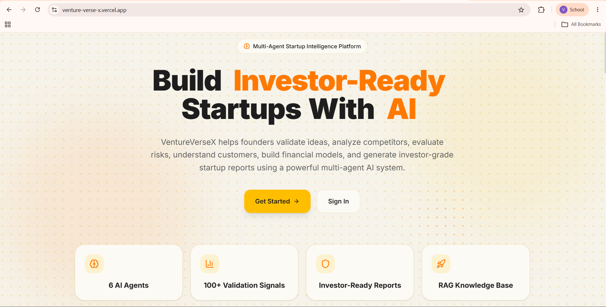
*The VentureVerseX landing page — animated grid hero, value proposition, and call-to-action. The entry point for all founders.*

---

## 2. Authentication Architecture

VentureVerseX implements two authentication paths — traditional credential login and Google OAuth2 — both converging on the same JWT-based session model. This is deliberate: OAuth2 handles identity federation, JWT handles stateless authorization for every subsequent API call.

### Traditional Authentication Flow

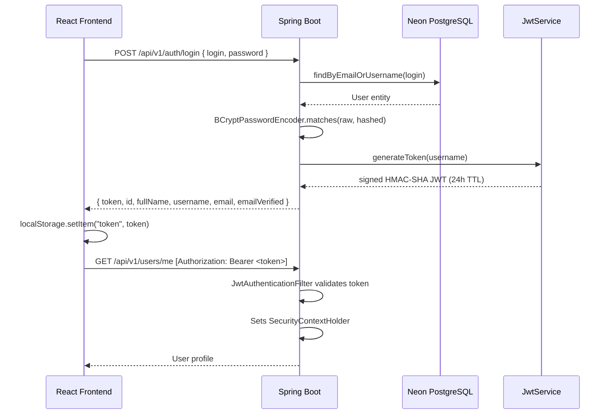

**Login field flexibility:** The `login` field accepts either an email address or a username. `UserServiceImpl` calls `findByEmailOrUsername()` on the User repository, making both credential forms valid without requiring two separate endpoints.

**Password storage:** BCrypt with default strength factor. Passwords are never stored in plaintext. The registration flow hashes the password before persisting the `User` entity.

**Token mechanics:** `JwtService` issues HMAC-SHA signed tokens with the username as the subject claim and a 24-hour expiration. Every subsequent request passes through `JwtAuthenticationFilter` (a `OncePerRequestFilter`) which extracts the Bearer token, validates signature and expiry, loads user details via `CustomUserDetailsService`, and populates `SecurityContextHolder`. The backend is entirely stateless — no HTTP sessions, no in-memory state.

---

### Google OAuth2 Authentication Flow

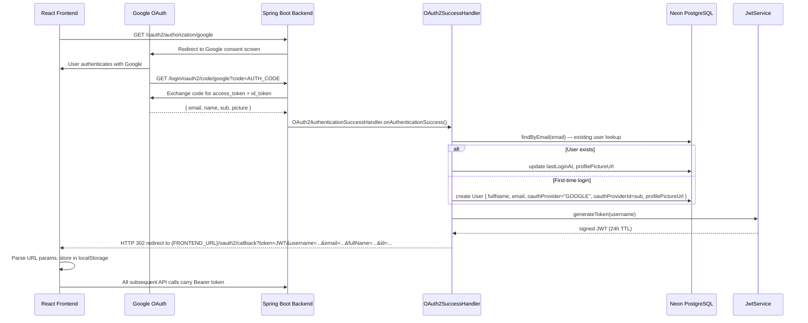

**Why OAuth2 and JWT coexist:** OAuth2 solves identity — Google vouches for who the user is. JWT solves authorization — once identity is confirmed, every API call must be independently verifiable without a round-trip to Google. The two protocols serve orthogonal concerns. OAuth2 is used exactly once (login); JWT is used for every subsequent request.

**First-time vs. returning user:** `OAuth2AuthenticationSuccessHandler` performs a database lookup by email. If no user exists, it creates a new `User` record with `oauthProvider="GOOGLE"` and the Google `sub` claim as `oauthProviderId`. If the user already exists (from a previous OAuth login), it updates `lastLoginAt` and `profilePictureUrl`. The generated JWT is then embedded in a redirect URL back to the frontend's `/oauth2/callback` route, where `OAuth2Callback.jsx` parses the query parameters and stores them in localStorage.

**Security configuration:** `SecurityConfig` marks the following paths as publicly accessible without JWT: `/api/v1/auth/**`, `/api/v1/users/**`, `/api/v1/reports/export/**`, `/api/v1/search/**`, `/api/v1/knowledge/**`, `/oauth2/**`, `/login/oauth2/**`. All other paths require a valid JWT. CORS is configured to allow `http://localhost:5173`, `http://localhost:3000`, and `https://venture-verse-x.vercel.app`.

---

## 3. Complete System Architecture

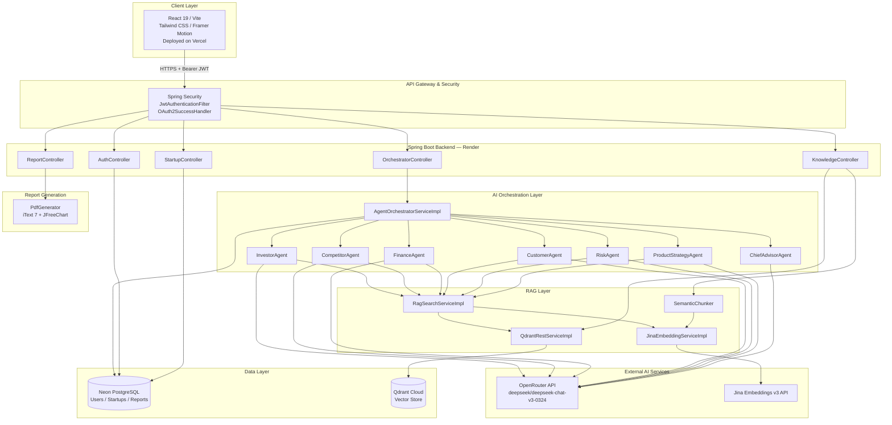

### Component Responsibilities

| Component | Responsibility |
|---|---|
| **React Frontend** | SPA with 19 pages, auth context, Axios interceptors for JWT injection, Recharts visualization, Framer Motion animations |
| **Spring Security** | JWT filter chain, OAuth2 client configuration, BCrypt, CORS, stateless session policy |
| **AuthController** | Registration, login, user lookup — issues JWTs |
| **StartupController** | CRUD for startup records owned by authenticated users |
| **OrchestratorController** | Entry point for analysis execution; delegates to `AgentOrchestratorServiceImpl` |
| **KnowledgeController** | Document upload and semantic search endpoints |
| **ReportController** | PDF generation and byte-stream delivery |
| **AgentOrchestratorServiceImpl** | Coordinates sequential agent execution, aggregates scores, persists `StartupReport` |
| **6 Specialist Agents** | Independent expert evaluators; each calls RAG then OpenRouter |
| **ChiefAdvisorAgent** | Synthesizes 6 agent outputs into executive summary and readiness score |
| **RagSearchServiceImpl** | Converts query to embedding, searches Qdrant, returns ranked chunks |
| **SemanticChunker** | Splits documents into 500-char chunks (100-char overlap) at sentence boundaries |
| **JinaEmbeddingServiceImpl** | Calls Jina v3 REST API to convert text to dense vectors |
| **QdrantRestServiceImpl** | HTTP client for Qdrant Cloud — upsert, search, filter operations |
| **PdfGenerator** | Renders `StartupReport` as a multi-page PDF using iText 7 with JFreeChart-generated charts |
| **Neon PostgreSQL** | Primary relational store — users, startups, and full report data |
| **Qdrant Cloud** | Vector store for knowledge base embeddings — used during RAG retrieval |

---

## 4. Startup Analysis Execution Flow

When `POST /api/v1/orchestrator/{startupId}` is received, the following sequence executes synchronously:

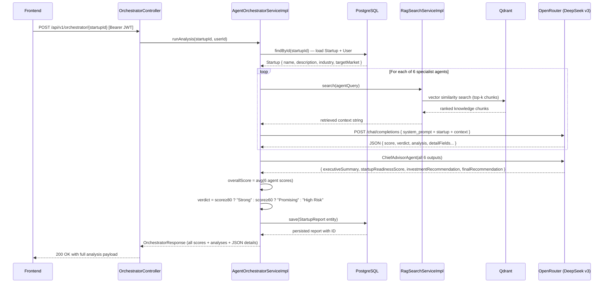

**OpenRouter configuration** (`OpenRouterClientImpl`):
- Model: `deepseek/deepseek-chat-v3-0324`
- `max_tokens`: 2500
- `temperature`: 0.3
- Transport: Spring `RestTemplate` POST to `https://openrouter.ai/api/v1/chat/completions`

**Scoring logic:** Each of the 6 agents returns a numeric score (0–100). The orchestrator computes the simple arithmetic mean. Verdict thresholds are applied as: `overallScore ≥ 80` → **Strong**, `≥ 60` → **Promising**, `< 60` → **High Risk**. The `startupReadinessScore` is separately computed by the `ChiefAdvisorAgent` and stored independently.

---

## 5. Multi-Agent Architecture
---

### Investor Agent

**Persona:** Venture Capital Partner  
**Frameworks:** Y Combinator evaluation model, Lean Startup, Business Model Canvas, SWOT  
**RAG query:** Market sizing, VC evaluation criteria, funding frameworks  
**Output JSON:**
```json
{
  "score": 74,
  "verdict": "Promising",
  "tam": "$48B global fitness tech market",
  "sam": "$12B app-based fitness segment",
  "som": "$240M realistically addressable in 3 years",
  "swotAnalysis": { "strengths": [...], "weaknesses": [...], "opportunities": [...], "threats": [...] },
  "analysis": "The AI coaching differentiation is credible, but CAC in fitness apps...",
  "investmentRecommendation": "Conditional investment pending..."
}
```
**Score impact:** `investmentScore` stored directly on `StartupReport`; contributes 1/6 weight to `overallScore`.

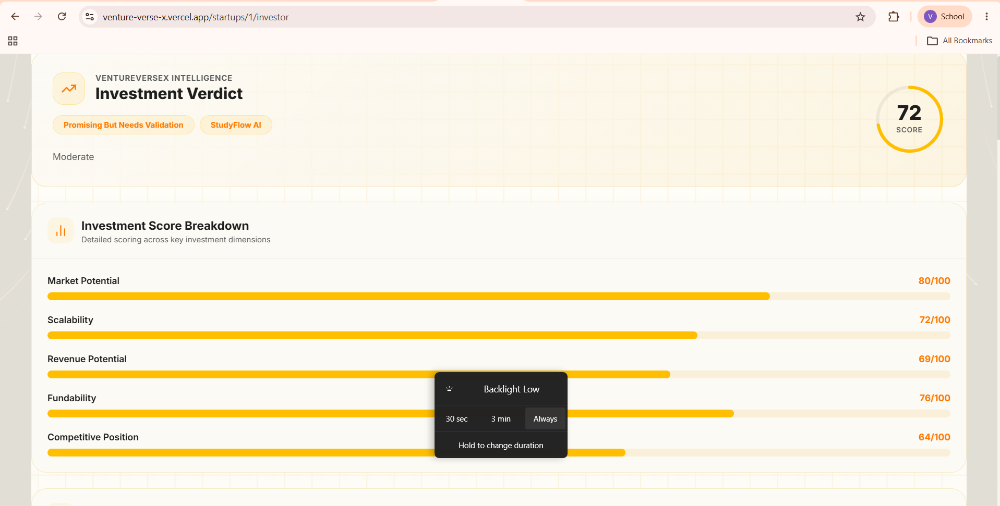
*The Investor Agent tab — displays TAM/SAM/SOM breakdown, SWOT analysis, and the VC Partner verdict with investment score.*

---

### Competitor Agent

**Persona:** Market Research Director  
**Frameworks:** Porter's Five Forces, Blue Ocean Strategy  
**RAG query:** Competitive landscape, market differentiation, industry analysis  
**Output JSON:**
```json
{
  "score": 65,
  "verdict": "Moderate",
  "topCompetitors": ["Peloton", "Whoop", "Future"],
  "competitiveAdvantages": ["AI personalization depth", "lower price point"],
  "marketGaps": ["No AI coaching for injury rehabilitation"],
  "barrierToEntry": "Medium — ML infrastructure is a moat",
  "competitorAnalysis": "..."
}
```

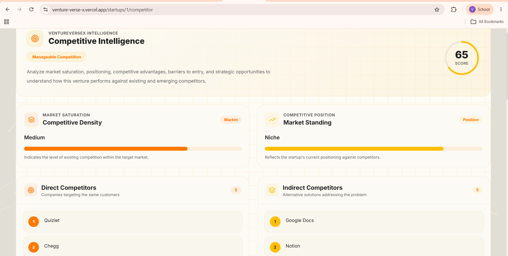
*The Competitor Agent tab — Porter's Five Forces assessment, top competitor mapping, market gaps, and barrier-to-entry analysis.*

---

### Finance Agent

**Persona:** CFO / Financial Due Diligence Specialist  
**Frameworks:** SaaS unit economics, burn rate modeling  
**RAG query:** SaaS financial metrics, revenue modeling, unit economics  
**Output JSON:**
```json
{
  "score": 58,
  "revenueModel": "Subscription ($29/mo)",
  "cac": "$45 estimated",
  "ltv": "$348 (12-month cohort)",
  "ltvCacRatio": "7.7x",
  "burnRate": "~$85K/month at seed",
  "runway": "18 months on $1.5M seed",
  "projections": { "year1": "$1.2M ARR", "year2": "$4.8M ARR", "year3": "$14M ARR" }
}
```

---

### Customer Agent

**Persona:** Customer Research Lead / Product-Market Fit Strategist  
**Frameworks:** Jobs-to-be-Done (JTBD), Product-Market Fit metrics  
**RAG query:** Customer segmentation, PMF research, user adoption patterns  
**Output JSON:**
```json
{
  "score": 71,
  "customerPersonas": [
    { "name": "Fitness Enthusiast", "age": "28-40", "pain": "Generic plans don't adapt to progress" },
    { "name": "Rehab User", "age": "35-55", "pain": "No AI-guided injury recovery programs" }
  ],
  "adoptionRisk": "Medium — behavior change product requires habit formation",
  "retentionStrategy": "Weekly goal check-ins, streak mechanics",
  "pmfSignals": "Growing waitlist, high NPS in beta"
}
```

---

### Risk Agent

**Persona:** Due Diligence Analyst  
**Output:** Risk matrix covering 9 categories: Market Risk, Technical Risk, Regulatory Risk, Team Risk, Financial Risk, Competitive Risk, Operational Risk, Legal Risk, Execution Risk — each with severity, likelihood, and mitigation strategy.

---

### Product Strategy Agent

**Persona:** Y Combinator Playbook Advisor  
**Output JSON:**
```json
{
  "score": 79,
  "mvpFeatures": ["AI workout generation", "progress tracking", "coach chat interface"],
  "roadmapPhases": {
    "phase1": "Core AI coaching (0–3 months)",
    "phase2": "Social features + marketplace (4–9 months)",
    "phase3": "Corporate wellness partnerships (10–18 months)"
  },
  "gtoStrategy": "Fitness influencer partnerships + freemium funnel",
  "90DayPlan": "Launch beta in 3 target cities, onboard 500 paying users",
  "kpis": ["DAU/MAU ratio", "session completion rate", "30-day retention"]
}
```

---

### Chief Advisor Agent (Executive Summary Synthesizer)

The `ChiefAdvisorAgent` receives the complete outputs of all 6 specialist agents as input. It does not re-query the startup description — it synthesizes expert verdicts. Its output populates `executiveSummary`, `startupReadinessScore`, `investmentRecommendation`, and `finalRecommendation` on the `StartupReport` entity.

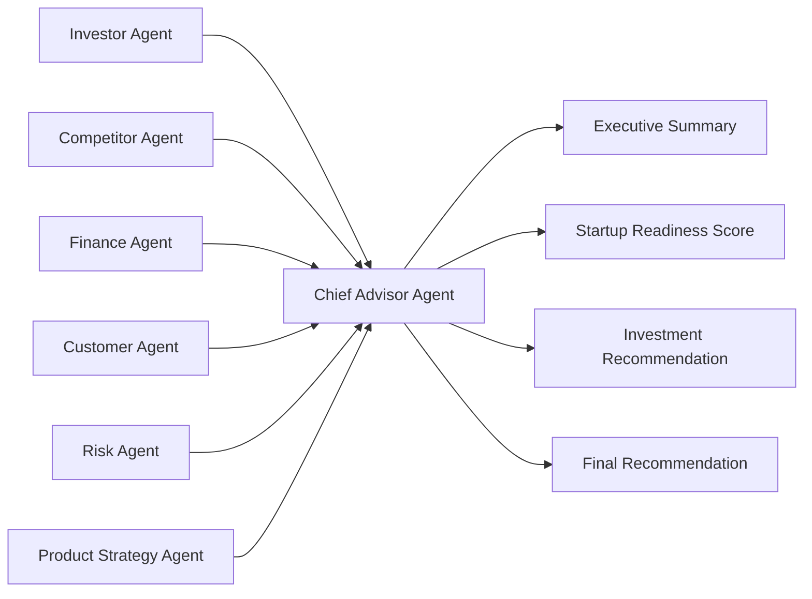

---

## 6. RAG Pipeline Architecture

### Why RAG Exists in VentureVerseX

Without RAG, every agent prompt would contain only the founder's startup description and the LLM's pre-trained parametric knowledge. Pre-trained knowledge is:

- **Stale** — LLMs don't know the 2024 SaaS benchmarks or current VC thesis trends.
- **Generic** — No Y Combinator batch-specific learnings, no Sequoia growth frameworks embedded in the reasoning.
- **Ungrounded** — TAM estimates and competitive landscapes are hallucinated from training data, not retrieved from curated sources.

RAG injects authoritative, domain-specific context — drawn from 44+ curated knowledge documents covering YC frameworks, Sequoia playbooks, PMF research, SaaS growth models, government grant funding, and case studies — directly into each agent's prompt before reasoning occurs.

**What breaks without RAG:** Agent scores would be based entirely on parametric LLM knowledge. Competitive analysis would lack framework grounding. Financial projections would have no benchmark basis. The overall quality difference is significant: grounded agents produce structured, defensible outputs; ungrounded agents produce generic, repetitive text.

### RAG Pipeline

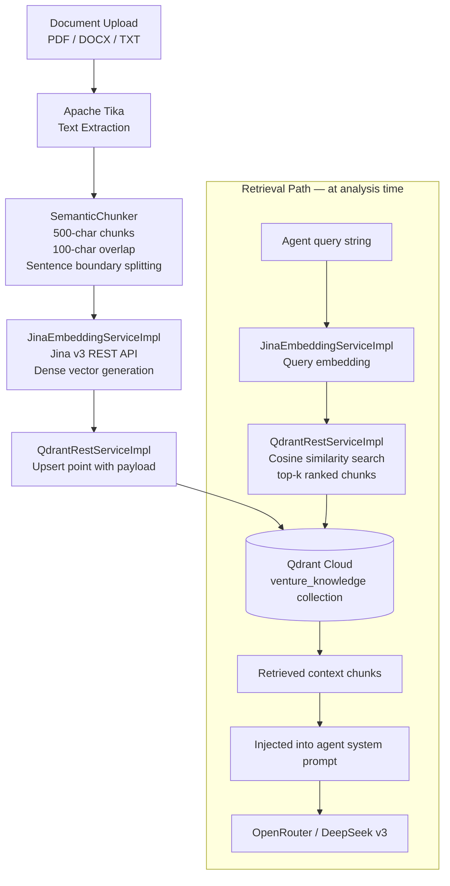

### Chunking Strategy

`SemanticChunker` applies a deliberate chunking strategy:
- **Chunk size:** 500 characters
- **Overlap:** 100 characters — ensures context continuity across chunk boundaries
- **Splitting:** Respects sentence boundaries — never splits mid-sentence
- **Section detection:** Identifies and tags chunk types (introduction, definition, example, strategy, conclusion) as metadata stored alongside the vector

### Context Injection

When an agent executes, `RagSearchServiceImpl.search()` converts the agent's domain query into a Jina embedding, retrieves the top-k most semantically similar chunks from Qdrant, and appends the raw text of those chunks to the agent's system prompt under a `[KNOWLEDGE CONTEXT]` header. The LLM then reasons over both the startup description and the retrieved expert knowledge simultaneously.

---

## 7. Knowledge Base Workflow

### Document Ingestion

**Endpoint:** `POST /api/v1/knowledge/upload`  
**Content-Type:** `multipart/form-data`

```bash
curl -X POST https://ventureversex-backend-deploy.onrender.com/api/v1/knowledge/upload \
  -H "Authorization: Bearer <JWT>" \
  -F "file=@sequoia_growth_playbook.pdf"
```

**Internal processing sequence:**

1. `KnowledgeController` receives the multipart file
2. `KnowledgeIngestionServiceImpl` passes raw bytes to Apache Tika for format-agnostic text extraction
3. Extracted text is passed to `SemanticChunker` — produces an array of overlapping text chunks, each tagged with section metadata
4. Each chunk is passed to `JinaEmbeddingServiceImpl` which calls the Jina v3 REST API and returns a dense float vector
5. Each (vector, payload) pair is upserted into Qdrant via `QdrantRestServiceImpl` with metadata: `{ source, chunkIndex, sectionType, text }`
6. Ingestion confirmation returned to caller

**Semantic Search:**

**Endpoint:** `GET /api/v1/knowledge/search?query=<text>&limit=<n>`

```bash
curl "https://ventureversex-backend-deploy.onrender.com/api/v1/knowledge/search?query=SaaS+unit+economics&limit=5" \
  -H "Authorization: Bearer <JWT>"
```

Response:
```json
{
  "results": [
    {
      "score": 0.94,
      "text": "LTV/CAC ratio above 3x is considered healthy for SaaS...",
      "source": "sequoia_growth_playbook.pdf",
      "sectionType": "strategy"
    }
  ]
}
```

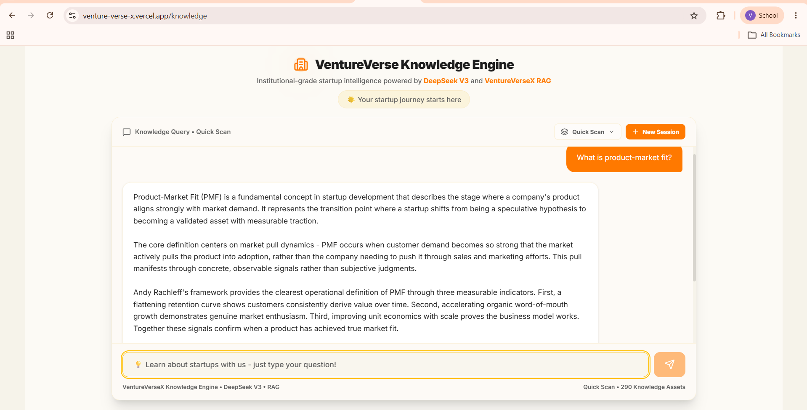
*The Knowledge Base page — document upload interface, ingestion status tracking, and semantic search over the curated VC knowledge corpus.*

---

## 8. Database Design

VentureVerseX uses Neon PostgreSQL as its primary relational store. All user identity, startup metadata, and full report content (including agent JSON outputs) are stored here.

### Entity Relationship Diagram

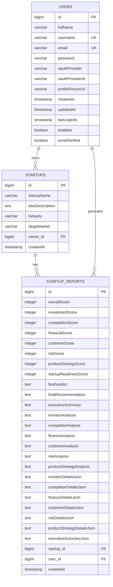

### Design Decisions

**Why agent JSON is stored as `TEXT` columns:** Each agent returns a rich, deeply nested JSON object. Storing as normalized relational tables would require 7 separate tables with complex join logic and frequent schema migrations as agent outputs evolve. TEXT columns allow the agent output schema to evolve independently — the frontend parses the JSON client-side. This is a deliberate denormalization tradeoff: query simplicity over schema purity.

**Why PostgreSQL over a document store:** User identity, startup ownership, and report relationships are fundamentally relational. Foreign key constraints enforce referential integrity — you cannot have a report without a startup, and a startup must have an owner. PostgreSQL's transactional guarantees ensure that a report is only persisted if all agent data is available.

---

## 9. Vector Database Design

Qdrant Cloud serves as the semantic index for the knowledge base. It stores dense float vectors (Jina v3 embeddings) alongside metadata payloads for filtered retrieval.

### Collection Structure

**Collection name:** `venture_knowledge`  
**Distance metric:** Cosine similarity  
**Vector dimension:** Determined by Jina v3 model output (typically 768 or 1024 dimensions)

### Point Payload Schema

```json
{
  "id": "uuid-chunk-identifier",
  "vector": [0.021, -0.143, 0.887, ...],
  "payload": {
    "text": "Product-market fit is achieved when retention curves flatten...",
    "source": "yc_startup_school_notes.txt",
    "chunkIndex": 12,
    "sectionType": "definition",
    "documentTitle": "Y Combinator Startup School — PMF Module",
    "uploadedAt": "2025-01-15T10:22:00Z"
  }
}
```

### Search Flow

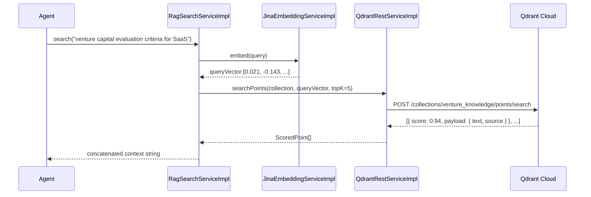

`RagSearchServiceImpl` exposes multiple retrieval strategies: `search` (basic cosine), `searchWithContext` (includes surrounding chunks), `searchWithKeywords` (hybrid BM25 + semantic), `searchWithMetadataFilter` (restrict by source or sectionType), and `searchDebug` (returns scores and ranking metadata for diagnostic purposes).

---

## 10. API Reference

Base URL: `https://ventureversex-backend-deploy.onrender.com/api/v1`

### Authentication APIs

---

#### `POST /api/v1/auth/register`

**Purpose:** Creates a new user account with hashed credentials.

**Request:**
```json
{
  "fullName": "Priya Sharma",
  "username": "priyasharma",
  "email": "priya@example.com",
  "password": "SecurePass123!"
}
```

**Validation:** All fields `@NotBlank`. Email format validated. Username uniqueness checked against DB before persist.

**Backend flow:** `AuthController` → `UserServiceImpl.register()` → BCrypt hash password → save `User` entity → `JwtService.generateToken(username)` → return `AuthResponse`

**Response:**
```json
{
  "token": "eyJhbGciOiJIUzI1NiJ9...",
  "id": 42,
  "fullName": "Priya Sharma",
  "username": "priyasharma",
  "email": "priya@example.com",
  "emailVerified": false
}
```

**Security:** Public endpoint (no JWT required).

---

#### `POST /api/v1/auth/login`

**Purpose:** Authenticates existing user via email or username + password.

**Request:**
```json
{
  "login": "priyasharma",
  "password": "SecurePass123!"
}
```

**Backend flow:** `UserServiceImpl.login()` → `findByEmailOrUsername(login)` → `BCrypt.matches()` → if match, `generateToken()` → return `AuthResponse`

**Response:** Same as register response structure.

**Security:** Public endpoint. Accepts both email and username in the `login` field.

---

#### `GET /api/v1/users/me`

**Purpose:** Returns the authenticated user's profile.

**Headers:** `Authorization: Bearer <token>`

**Backend flow:** `JwtAuthenticationFilter` validates token → extracts username → `CustomUserDetailsService.loadUserByUsername()` → `SecurityUtils.getCurrentUser()` → return `UserResponse`

**Response:**
```json
{
  "id": 42,
  "fullName": "Priya Sharma",
  "username": "priyasharma",
  "email": "priya@example.com",
  "profilePictureUrl": null,
  "emailVerified": false
}
```

---

### Startup APIs

---

#### `POST /api/v1/startups`

**Purpose:** Creates a new startup record associated with the authenticated user.

**Request:**
```json
{
  "startupName": "FitCoach AI",
  "ideaDescription": "An AI-powered fitness coach that generates personalized workout plans and adapts in real-time based on user progress and biometrics.",
  "industry": "Health & Fitness Technology",
  "targetMarket": "Fitness enthusiasts aged 25–45 seeking personalized coaching without high personal trainer costs"
}
```

**Validation:** All 4 fields `@NotBlank`. Authenticated user is set as `owner`.

**Response:**
```json
{
  "id": 7,
  "startupName": "FitCoach AI",
  "ideaDescription": "...",
  "industry": "Health & Fitness Technology",
  "targetMarket": "...",
  "createdAt": "2025-06-22T10:15:00"
}
```

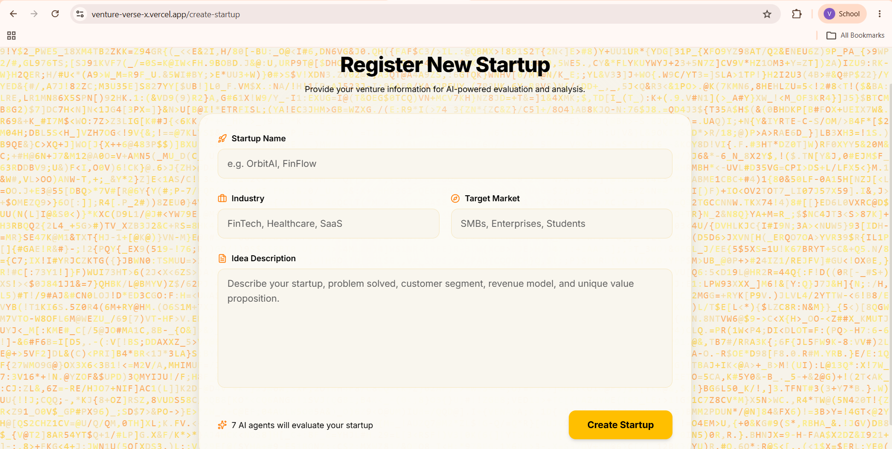
*The startup creation form — founder provides the startup name, idea description, industry, and target market. These four fields drive all downstream agent analysis.*

---

#### `GET /api/v1/startups`

**Purpose:** Returns all startups owned by the authenticated user.

**Response:** Array of `StartupResponse` objects, ordered by `createdAt` descending.

---

#### `GET /api/v1/startups/{id}`

**Purpose:** Returns a single startup by ID. Verifies ownership — returns 403 if the startup belongs to another user.

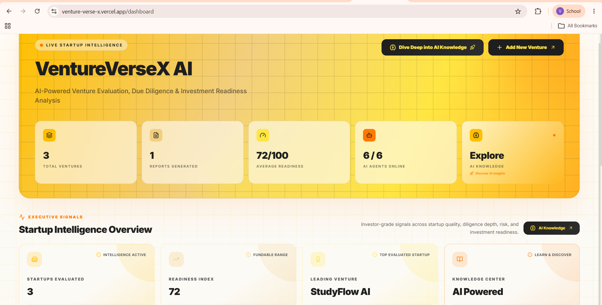
*The founder dashboard — lists all created startups as cards, with creation date, industry, and a quick-launch analysis button per startup.*

---

### Orchestrator API

---

#### `POST /api/v1/orchestrator/{startupId}`

**Purpose:** Executes the full 7-agent analysis pipeline for the given startup and persists a `StartupReport`.

**Headers:** `Authorization: Bearer <token>`

**Backend flow:**
1. Load `Startup` + `User` from PostgreSQL
2. For each of 6 agents: RAG retrieval → OpenRouter call → parse JSON response
3. ChiefAdvisorAgent call with all 6 outputs
4. Compute `overallScore`, apply verdict threshold
5. Build and persist `StartupReport` entity
6. Return full `OrchestratorResponse`

**Response (abbreviated):**
```json
{
  "reportId": 15,
  "overallScore": 69,
  "finalVerdict": "Promising",
  "investmentScore": 74,
  "competitionScore": 65,
  "financialScore": 58,
  "customerScore": 71,
  "riskScore": 67,
  "productStrategyScore": 79,
  "startupReadinessScore": 68,
  "executiveSummary": "FitCoach AI demonstrates strong product differentiation...",
  "investorAnalysis": "...",
  "competitorAnalysis": "...",
  "investorDetailsJson": "{ \"tam\": \"$48B\", ... }",
  "createdAt": "2025-06-22T10:18:43"
}
```

**Note:** This endpoint is computationally expensive — it makes 7 sequential LLM calls. Average response time in production is 25–45 seconds depending on OpenRouter latency.

---

### Knowledge APIs

---

#### `POST /api/v1/knowledge/upload`

**Purpose:** Ingests a document into the RAG knowledge base.  
**Content-Type:** `multipart/form-data`  
**Field:** `file` — supports PDF, DOCX, TXT

**Internal flow:** Tika extraction → SemanticChunker → Jina embedding per chunk → Qdrant upsert

---

#### `GET /api/v1/knowledge/search`

**Purpose:** Performs semantic search over the knowledge base.

**Query params:** `query` (string), `limit` (int, default 5)

**Security:** Publicly accessible (no JWT required) — allows search without authentication.

---

### Report API

---

#### `GET /api/v1/reports/export/{reportId}`

**Purpose:** Generates and streams a PDF version of the specified `StartupReport`.

**Security:** Publicly accessible (no JWT required) — enabling direct download links.

**Backend flow:** `ReportController` → `PdfGenerator.generate(report)` → iText 7 renders multi-section PDF with JFreeChart score radar/bar charts → `byte[]` returned as `application/pdf` response

**Note:** PDF includes: cover page, executive summary, score breakdown with charts, all 6 agent analysis sections, strategic recommendations, and appendix with raw JSON data.

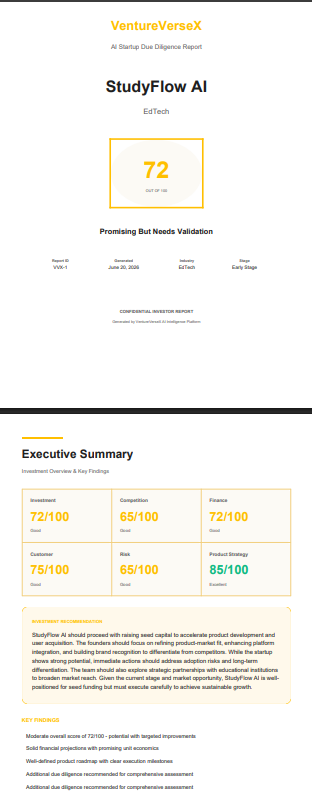
*Sample exported PDF report — iText 7 renders a multi-page document with JFreeChart radar chart, per-agent analysis sections, and strategic recommendations.*

---

## 11. Project Structure

```
VentureVerseX/
├── backend/
│   └── ventureverse-api/
│       ├── src/main/java/com/ventureverse/ventureverse_api/
│       │   ├── ai/
│       │   │   ├── agent/              ← 6 specialist agents + ChiefAdvisorAgent
│       │   │   ├── client/             ← OpenRouterClientImpl (RestTemplate)
│       │   │   ├── orchestrator/       ← AgentOrchestratorServiceImpl + DTOs
│       │   │   └── rag/                ← RAG services, chunker, Jina, Qdrant clients
│       │   ├── config/                 ← Spring beans, CORS, RestTemplate config
│       │   ├── controller/             ← REST controllers (Auth, Startup, User, Report)
│       │   ├── dto/
│       │   │   ├── request/            ← Input DTOs with validation annotations
│       │   │   └── response/           ← Output DTOs
│       │   ├── entities/               ← JPA entities (User, Startup, StartupReport)
│       │   ├── exceptions/             ← Custom exception classes + global handler
│       │   ├── repository/             ← Spring Data JPA repositories
│       │   ├── security/               ← JwtService, JwtFilter, OAuth2Handler, SecurityConfig
│       │   └── service/                ← Business logic implementations
│       ├── src/main/resources/
│       │   ├── knowledge_backup/       ← 44+ .txt knowledge source files
│       │   └── application.properties
│       ├── Dockerfile
│       └── render.yaml
├── frontend/
│   ├── src/
│   │   ├── api/                        ← api.js (Axios instance + interceptors)
│   │   ├── components/                 ← 28+ reusable components
│   │   │   ├── ui/                     ← ScoreCard, AgentTab, RadarChartComponent
│   │   │   └── effects/                ← DecryptedText, DotGrid, Lightfall, etc.
│   │   ├── context/                    ← AuthContext.jsx (JWT state management)
│   │   ├── layouts/                    ← MainLayout, StartupWorkspaceLayout
│   │   └── pages/                      ← 19 page components
│   ├── vercel.json                     ← SPA rewrite rules
│   └── vite.config.js
└── .env
```

### Package Responsibilities

| Package | Responsibility |
|---|---|
| `ai/agent/` | Contains all 7 agent classes. Each agent is a `@Service` that constructs a system prompt, calls `OpenRouterClientImpl`, and parses the JSON response into a typed response DTO. |
| `ai/client/` | `OpenRouterClientImpl` — the sole LLM gateway. Owns the HTTP client, model selection (`deepseek-chat-v3-0324`), temperature (`0.3`), and token limit (`2500`). |
| `ai/orchestrator/` | `AgentOrchestratorServiceImpl` — the pipeline coordinator. Manages execution order, score aggregation, verdict logic, and report persistence. Also contains all orchestrator-specific DTOs. |
| `ai/rag/` | All RAG infrastructure: `SemanticChunker`, `JinaEmbeddingServiceImpl`, `QdrantRestServiceImpl`, `RagSearchServiceImpl`, `KnowledgeIngestionServiceImpl`, `ContextBuilderServiceImpl`. |
| `security/` | `SecurityConfig` (filter chain), `JwtService` (token generation/validation), `JwtAuthenticationFilter` (request-level enforcement), `OAuth2AuthenticationSuccessHandler` (post-Google-auth JWT issuance). |
| `entities/` | JPA-mapped domain objects. `User`, `Startup`, `StartupReport` define the relational schema via Hibernate. |
| `dto/` | All request and response transfer objects. Validation annotations live on request DTOs (`@NotBlank`, `@Email`). |
| `repository/` | Spring Data JPA interfaces. Auto-generates SQL queries from method name conventions (e.g., `findByEmailOrUsername`). |
| `controller/` | Thin HTTP adapters. Deserialize request bodies, call services, serialize responses. Contain no business logic. |
| `service/` | Business logic implementations. `UserServiceImpl`, `StartupServiceImpl` handle CRUD operations, validation, and service orchestration. |
| `frontend/api/` | `api.js` configures a single Axios instance pointing to the production backend URL, with a request interceptor that automatically injects the JWT from localStorage into every outgoing `Authorization` header. A response interceptor catches 401s and triggers automatic logout. |
| `frontend/context/` | `AuthContext.jsx` provides authentication state (user, token, isAuthenticated) to the entire component tree via React Context. |
| `frontend/pages/` | 19 page components covering: landing, auth flows, dashboard, startup creation, 6 analysis tabs, report history, knowledge upload, profile, and settings. |
| `frontend/components/effects/` | Visual components (DecryptedText, DotGrid, FaultyTerminal, GridScan, Lightfall, ScrollVelocity) that implement the platform's premium UI aesthetic using canvas animations and GSAP. |

---

## 12. Technology Decisions

### Backend Runtime

| Criterion | Spring Boot (chosen) | Node.js (alternative) |
|---|---|---|
| Type safety | Compile-time (Java 21) | Runtime only |
| Spring Security | Mature, OAuth2 first-class | Passport.js (fragmented) |
| JPA / Hibernate | Automatic schema management | Manual ORM configuration |
| PDF generation | iText 7 (Java-native) | Complex multi-library setup |
| Team familiarity | Java ecosystem | — |

---

### Primary Database

| Criterion | PostgreSQL (chosen) | MongoDB (alternative) |
|---|---|---|
| Relational integrity | Native FK constraints | Application-level only |
| Startup-report ownership | JOIN queries, guaranteed consistency | Embedded documents or references |
| ACID transactions | Full compliance | Partial (multi-doc since 4.0) |
| JSON storage | `TEXT` columns for agent JSON (intentional) | Native BSON |
| Hosting | Neon (serverless, scales to zero) | Atlas |

---

### Vector Store

| Criterion | Qdrant (chosen) | Pinecone (alternative) |
|---|---|---|
| Deployment | Cloud + self-host both available | Cloud only |
| Filter capabilities | Rich payload filtering (by source, section) | Metadata filtering (less flexible) |
| REST API | Full REST + gRPC | REST only |
| Pricing | Generous free tier on Qdrant Cloud | Limited free tier |
| Observability | Collection stats, segment inspection | Limited |

---

### Session Model

| Criterion | JWT (chosen) | Server Sessions (alternative) |
|---|---|---|
| Statefulness | Stateless — no server memory needed | Stateful — requires shared session store |
| Scalability | Horizontal scale with no session sync | Redis or sticky sessions required |
| OAuth2 integration | Natural fit — issue JWT after OAuth dance | Cookie-based session post-OAuth |
| Mobile readiness | Bearer token works universally | Cookie-based is browser-centric |

---

### LLM Gateway

| Criterion | OpenRouter (chosen) | Direct OpenAI (alternative) |
|---|---|---|
| Model flexibility | 200+ models via single API | OpenAI models only |
| Cost optimization | Route to cheapest model per task | Fixed pricing |
| Current model | `deepseek/deepseek-chat-v3-0324` | `gpt-4o` or similar |
| Failover | Automatic provider fallback | Manual |

---

### Embeddings

| Criterion | Jina v3 (chosen) | OpenAI `text-embedding-ada-002` |
|---|---|---|
| Cost | Lower per-call cost | Higher per-call cost |
| Performance | Competitive on retrieval benchmarks | Strong baseline |
| API simplicity | REST, straightforward | REST, requires key rotation |

## Architecture Decisions

### Why Multi-Agent Architecture?

Startup evaluation is inherently multi-dimensional. A single LLM prompt tends to produce broad but shallow analysis across investment potential, competition, financial viability, customer demand, risk, and product strategy.

VentureVerseX uses specialized AI agents, each focused on a single domain, to produce deeper and more structured reasoning. This approach improves analysis quality, reduces prompt complexity, and enables independent scoring for each business dimension.

**Tradeoff:** Increased latency due to multiple LLM calls during report generation.

---

### Why Retrieval-Augmented Generation (RAG)?

Startup intelligence depends on domain-specific knowledge such as venture capital frameworks, startup case studies, product-market fit research, and SaaS growth strategies.

Instead of relying solely on LLM training data, VentureVerseX retrieves relevant knowledge from a curated vector database and injects it into agent prompts at runtime.

This enables:

- More grounded recommendations
- Reduced hallucinations
- Easily updatable knowledge without model retraining
- Better alignment with real-world startup frameworks

**Tradeoff:** Additional infrastructure complexity and retrieval latency.

---

### Why PostgreSQL?

The platform manages strongly related entities including:

- Users
- Startups
- Startup Reports

PostgreSQL provides:

- ACID transactions
- Referential integrity
- Strong relational modeling
- Mature ecosystem
- Reliable production deployment

This makes it a better fit than a document database for VentureVerseX's ownership and reporting relationships.

---

### Why Qdrant?

Qdrant was selected as the vector database because it provides:

- High-performance semantic search
- Metadata filtering
- Open-source flexibility
- Cloud-hosted deployment options
- Cost-effective scaling

The platform uses Qdrant to store and retrieve startup knowledge embeddings used by the RAG pipeline.

---

### Why OpenRouter?

VentureVerseX is designed to remain model-agnostic.

OpenRouter provides:

- Access to multiple LLM providers through a single API
- Easy model switching
- Cost optimization
- Provider redundancy
- Future extensibility

This prevents vendor lock-in and allows experimentation with different models without changing application logic.

---

### Why Spring Boot?

Spring Boot was chosen for its:

- Enterprise-grade architecture
- Mature security ecosystem
- Built-in OAuth2 support
- Robust dependency injection
- Strong integration with PostgreSQL and REST APIs

The framework enables rapid development while maintaining production-level reliability and scalability.

---

### Why OAuth2 + JWT?

OAuth2 and JWT solve different problems.

OAuth2 handles identity verification through Google authentication.

JWT provides stateless authorization for subsequent API requests.

Combining both approaches allows users to authenticate securely through Google while enabling scalable backend authorization without server-side sessions.

---

## 13. Engineering Challenges & Tradeoffs

### Why Multi-Agent Instead of a Single Prompt?

A single prompt asking an LLM to "evaluate this startup across investment, competition, finance, customer, risk, and product strategy" produces shallow analysis across all dimensions. Agent specialization forces depth: each agent has a dedicated system prompt, a specific expert persona, targeted RAG retrieval, and a constrained output schema. The result is 6 independent expert opinions that can disagree — which is architecturally more honest than a single monolithic score.

**Current limitation:** Agents execute sequentially, not in parallel. Each OpenRouter call adds ~4–8 seconds of latency. Full pipeline execution takes 25–45 seconds. A parallel execution strategy using Java's `CompletableFuture` would reduce this to the duration of the slowest agent.

### Why RAG Instead of Fine-tuning?

Fine-tuning a model on VC frameworks and startup playbooks would require: labeled training data, compute budget, and re-training on knowledge updates. RAG allows the knowledge base to be updated by uploading a document — no model retraining required. This is operationally superior for a knowledge-intensive application where domain content changes frequently.

**Current limitation:** RAG retrieval is purely semantic. There is no BM25 hybrid search fallback for exact-match queries. The `searchWithKeywords` method in `RagSearchServiceImpl` begins to address this but is not yet the default retrieval path.

### Why PostgreSQL for Report Storage?

Agent JSON outputs are stored as `TEXT` columns rather than normalized tables. This is a deliberate tradeoff: as agent output schemas evolve, there are no migration scripts required. The frontend parses the JSON dynamically. The downside is that you cannot run SQL aggregations over nested agent fields without `JSON_EXTRACT` queries. For the current access pattern (load full report by ID), TEXT storage is optimal.

### Why OAuth2 When JWT Already Exists?

OAuth2 is not redundant with JWT — it operates at a different layer. OAuth2 delegates identity verification to Google. VentureVerseX does not manage Google passwords, MFA, or account recovery for OAuth users. JWT is VentureVerse's authorization mechanism once identity is established. Removing OAuth2 would require building password reset flows, email verification, and social login alternatives from scratch.

### Scaling Bottlenecks

| Bottleneck | Current State | Mitigation Path |
|---|---|---|
| Sequential agent execution | ~45s total | Parallel via `CompletableFuture` |
| Single Render instance | Cold starts on free tier | Upgrade to paid Render instance |
| Synchronous OpenRouter calls | Blocks request thread | Async execution + webhook callback |
| Single Qdrant collection | All knowledge in one namespace | Per-user collections or metadata isolation |
| PDF generation in-process | Memory spike during export | Offload to background job queue |

---

## 14. Production Deployment Architecture

### Infrastructure Map

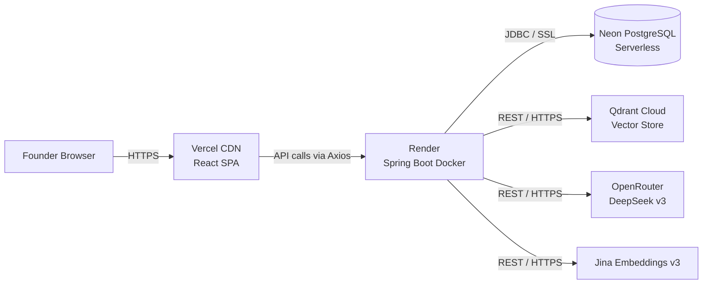

### Complete Production Request Lifecycle

**Scenario:** Founder clicks "Generate Analysis" for startup ID 7.

```
1. React calls: POST https://ventureversex-backend-deploy.onrender.com/api/v1/orchestrator/7
   Headers: { Authorization: "Bearer eyJ..." }

2. Render receives request (Docker container, eclipse-temurin:21-jdk base)

3. JwtAuthenticationFilter intercepts:
   → Extracts Bearer token from Authorization header
   → JwtService.validateToken() — checks HMAC-SHA signature + expiry
   → CustomUserDetailsService.loadUserByUsername() → Neon DB query
   → SecurityContextHolder populated

4. OrchestratorController.runAnalysis(7) → AgentOrchestratorServiceImpl

5. startupRepository.findById(7) → Neon PostgreSQL
   Returns: { startupName: "FitCoach AI", ideaDescription: "...", industry: "...", targetMarket: "..." }

6. For InvestorAgent:
   → RagSearchServiceImpl.search("venture capital evaluation SaaS investment criteria")
   → JinaEmbeddingServiceImpl: POST https://api.jina.ai/v1/embeddings → queryVector
   → QdrantRestServiceImpl: POST https://<cluster>.qdrant.io/collections/venture_knowledge/points/search
   → Top 5 chunks returned (YC frameworks, Sequoia growth thesis)
   → OpenRouterClientImpl: POST https://openrouter.ai/api/v1/chat/completions
     { model: "deepseek/deepseek-chat-v3-0324", messages: [system+context+startup], max_tokens: 2500, temperature: 0.3 }
   → Response parsed to InvestorResponse DTO

7. Steps 6 repeated for Competitor, Finance, Customer, Risk, ProductStrategy agents

8. ChiefAdvisorAgent receives all 6 responses → final OpenRouter call

9. overallScore = (74+65+58+71+67+79) / 6 = 69
   finalVerdict = "Promising" (60 ≤ 69 < 80)

10. startupReportRepository.save(StartupReport entity)
    → Neon PostgreSQL INSERT with all scores, analyses, JSON columns

11. OrchestratorResponse serialized as JSON → HTTP 200 returned to React

12. React renders analysis workspace with agent tabs, score cards, radar chart
```

### Environment Variables (render.yaml)

```yaml
envVars:
  - key: DB_URL
    value: jdbc:postgresql://<neon-host>/ventureverse
  - key: DB_USERNAME
    value: <neon-user>
  - key: DB_PASSWORD
    value: <secret>
  - key: OPENROUTER_API_KEY
    value: <openrouter-key>
  - key: QDRANT_URL
    value: https://<cluster>.qdrant.io
  - key: QDRANT_API_KEY
    value: <qdrant-key>
  - key: JINA_API_KEY
    value: <jina-key>
  - key: GOOGLE_CLIENT_ID
    value: <google-oauth-client-id>
  - key: GOOGLE_CLIENT_SECRET
    value: <google-oauth-client-secret>
  - key: FRONTEND_URL
    value: https://venture-verse-x.vercel.app
```

---

## 15. Local Development Setup

### Prerequisites

| Requirement | Version | Purpose |
|---|---|---|
| JDK | 21+ | Backend runtime |
| Maven | 3.9+ | Build tool |
| Node.js | 20+ | Frontend build |
| npm | 10+ | Package management |
| PostgreSQL | 15+ (or Neon free tier) | Primary database |
| Docker (optional) | 24+ | Backend containerization |

### Backend Setup

```bash
# 1. Clone the repository
git clone https://github.com/YashwanthChowdaryV/Venture-Verse-X.git
cd VentureVerseX/backend/ventureverse-api

# 2. Copy the example properties file
cp src/main/resources/application-example.properties src/main/resources/application.properties

# 3. Edit application.properties with your credentials (see env vars section above)

# 4. Build and run
mvn clean install
mvn spring-boot:run
```

Backend starts on: `http://localhost:8080`

### Frontend Setup

```bash
cd VentureVerseX/frontend

# 1. Install dependencies
npm install

# 2. Create environment file
echo "VITE_API_BASE_URL=http://localhost:8080/api/v1" > .env.local

# 3. Start dev server
npm run dev
```

Frontend starts on: `http://localhost:5173`

### Database Setup

**Option A — Local PostgreSQL:**
```sql
CREATE DATABASE ventureversex;
CREATE USER ventureversex_user WITH PASSWORD 'yourpassword';
GRANT ALL PRIVILEGES ON DATABASE ventureversex TO ventureversex_user;
```

**Option B — Neon (recommended):**
Create a free database at [neon.tech](https://neon.tech) and copy the connection string to `application.properties`. Hibernate's `spring.jpa.hibernate.ddl-auto=update` will auto-create all tables on first startup.

### Qdrant Setup

**Option A — Qdrant Cloud (recommended):**
1. Create a free cluster at [cloud.qdrant.io](https://cloud.qdrant.io)
2. Copy the cluster URL and API key to `application.properties`
3. `QdrantCollectionInitializer` creates the `venture_knowledge` collection automatically on startup

**Option B — Local Docker:**
```bash
docker run -p 6333:6333 qdrant/qdrant
# Set QDRANT_URL=http://localhost:6333 in application.properties
```

### Google OAuth Setup

1. Create a project at [console.cloud.google.com](https://console.cloud.google.com)
2. Enable Google OAuth2 API
3. Create OAuth credentials (Web Application type)
4. Add authorized redirect URI: `http://localhost:8080/login/oauth2/code/google`
5. Copy `Client ID` and `Client Secret` to `application.properties`

### OpenRouter Setup

1. Create account at [openrouter.ai](https://openrouter.ai)
2. Generate API key
3. Add to `OPENROUTER_API_KEY` in `application.properties`

### Expected Startup Logs

```
Started VentureVerseApiApplication in 4.2 seconds
Hibernate: create table if not exists users (...)
Hibernate: create table if not exists startups (...)
Hibernate: create table if not exists startup_reports (...)
QdrantCollectionInitializer: Collection 'venture_knowledge' ready
Qdrant connection verified: http://localhost:6333
```

### Health Checks

| Service | URL | Expected |
|---|---|---|
| Backend | `http://localhost:8080/api/v1/auth/check-username?username=test` | `200 OK` |
| Frontend | `http://localhost:5173` | Landing page renders |
| Qdrant | `http://localhost:6333/dashboard` | Qdrant UI |

### Troubleshooting

| Issue | Likely Cause | Fix |
|---|---|---|
| `Connection refused :5432` | PostgreSQL not running | Start PostgreSQL service |
| `401 Unauthorized` on all APIs | JWT secret mismatch between restarts | Ensure `JWT_SECRET` is set consistently |
| OAuth2 redirect fails | Redirect URI not registered in Google Console | Add `http://localhost:8080/login/oauth2/code/google` |
| Qdrant `404 Collection not found` | Collection not initialized | Check `QdrantCollectionInitializer` bean is loading |
| OpenRouter `429 Rate Limit` | Too many concurrent analysis requests | Add `Thread.sleep` between agent calls or upgrade plan |

---

## 16. Sample End-to-End Execution

### Startup: FitCoach AI — An AI-Powered Fitness Coach

**Step 1 — Input (Startup Creation)**
```json
POST /api/v1/startups
{
  "startupName": "FitCoach AI",
  "ideaDescription": "An AI-powered fitness coaching platform that generates personalized, adaptive workout and nutrition plans. Uses computer vision for form correction and NLP for natural language goal-setting conversations.",
  "industry": "Health & Fitness Technology",
  "targetMarket": "Fitness enthusiasts aged 25–45 seeking personalized coaching without the $150/hr cost of a human personal trainer"
}
```

**Step 2 — Storage**

PostgreSQL `startups` table receives a new row:
```
id=7, owner_id=42, startupName="FitCoach AI", industry="Health & Fitness Technology", createdAt=2025-06-22T10:15:00
```

**Step 3 — Analysis Trigger**
```
POST /api/v1/orchestrator/7
```

**Step 4 — RAG Retrieval Per Agent**

| Agent | Query Sent to RAG | Top Retrieved Chunk Source |
|---|---|---|
| Investor | "AI fitness app VC investment criteria TAM SAM SOM" | YC Startup School — Market Sizing |
| Competitor | "fitness technology competitive landscape Porter's Five Forces" | A16Z Consumer Health Report |
| Finance | "SaaS subscription unit economics LTV CAC fitness app" | Sequoia Growth Playbook |
| Customer | "fitness app user personas JTBD product market fit retention" | PMF Research — Retention Patterns |
| Risk | "fitness app regulatory risk HIPAA data privacy" | Regulatory Risk Framework |
| Product Strategy | "fitness MVP roadmap GTM strategy go-to-market" | YC GTM Playbook |

**Step 5 — Agent Outputs (Abbreviated)**

```
InvestorAgent:   score=74, verdict="Promising", TAM=$48B, SAM=$12B, SOM=$240M
CompetitorAgent: score=65, verdict="Moderate",  top competitors: Peloton, Future, Whoop
FinanceAgent:    score=58, verdict="Needs Work", LTV=$348, CAC=$45, LTV/CAC=7.7x
CustomerAgent:   score=71, verdict="Promising",  2 personas identified, medium PMF risk
RiskAgent:       score=67, verdict="Moderate",   top risk: HIPAA compliance for biometric data
ProductStrategy: score=79, verdict="Strong",     clear MVP, 3-phase roadmap, influencer GTM
```

**Step 6 — Score Aggregation**
```
overallScore = (74 + 65 + 58 + 71 + 67 + 79) / 6 = 414 / 6 = 69
```

**Step 7 — Verdict Applied**
```
69 ≥ 60 → finalVerdict = "Promising"
```

**ChiefAdvisor Summary (excerpt):**
> *"FitCoach AI presents a credible value proposition in a large and growing market. The financial model requires refinement — CAC efficiency must improve before Series A. The HIPAA compliance risk is the primary technical blocker. With the right compliance architecture and a focused go-to-market through fitness influencers, the startup has a clear path to product-market fit. Conditional investment recommended pending regulatory clarity."*

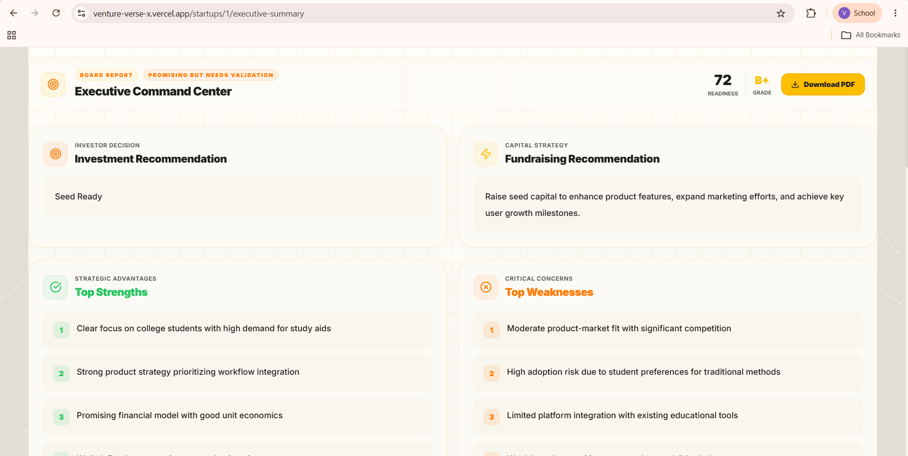
*The Executive Summary tab — the Chief Advisor Agent's synthesized verdict, startup readiness score, investment recommendation, and final strategic guidance.*

**Step 8 — Report Stored**

`startup_reports` table receives all 8 scores, 6 analysis texts, 7 JSON blobs, and the executive summary.

**Step 9 — PDF Export**

`GET /api/v1/reports/export/15` → iText 7 renders a 12-page PDF including:
- Cover: "FitCoach AI — Startup Intelligence Report"  
- Executive Summary  
- Score radar chart (JFreeChart)  
- Investment Analysis (3 pages)  
- Competitive Landscape  
- Financial Projections table  
- Customer Persona profiles  
- Risk Matrix (9 categories)  
- Product Roadmap  
- Strategic Recommendations

---

## 17. Screenshots

Screenshots are embedded inline throughout this document at the relevant sections. Quick reference index:

| Screenshot | Location in Document | File |
|---|---|---|
| **Landing Page** | §1 How VentureVerseX Works | [LandingPage.png](frontend/docs/screenshots/LandingPage.png) |
| **Create Startup** | §10 API Reference — POST /api/v1/startups | [CreateStartUp.png](frontend/docs/screenshots/CreateStartUp.png) |
| **Dashboard** | §10 API Reference — GET /api/v1/startups/{id} | [Dashboard.png](frontend/docs/screenshots/Dashboard.png) |
| **Investor Verdict** | §5 Multi-Agent Architecture — Investor Agent | [InvestorVerdict.png](frontend/docs/screenshots/InvestorVerdict.png) |
| **Competitive Analysis** | §5 Multi-Agent Architecture — Competitor Agent | [CompetitiveAnalysis.png](frontend/docs/screenshots/CompetitiveAnalysis.png) |
| **Knowledge Base** | §7 Knowledge Base Workflow | [KnowledgeBase.png](frontend/docs/screenshots/KnowledgeBase.png) |
| **Executive Summary** | §16 Sample End-to-End Execution — Step 7 Verdict | [ExecutiveSummary.png](frontend/docs/screenshots/ExecutiveSummary.png) |
| **PDF Report** | §10 API Reference — GET /api/v1/reports/export | [pdf.png](frontend/docs/screenshots/pdf.png) |


---

## 18. Future Roadmap

### Agent Memory
Persistent agent memory across analysis sessions — agents learn from previous startup evaluations to refine industry-specific scoring calibration. Implemented via a dedicated memory store (e.g., Zep or a PostgreSQL `agent_memory` table) keyed by industry and startup archetype.

### Agent Collaboration
Replace sequential agent execution with a collaborative multi-round protocol — agents share intermediate insights and challenge each other's verdicts before the ChiefAdvisor synthesizes. Architecturally, this moves from a pipeline model to a graph model (e.g., LangGraph-style state machine).

### Real-Time Market Intelligence
Supplement the static knowledge base with live data: Crunchbase funding rounds, Product Hunt launches, Hacker News discussions, and patent filings. A scheduled ingestion job would keep Qdrant fresh with current competitive intelligence.

### Investor Matching
Match startup profiles to actual VC firms based on investment thesis alignment. Requires a structured VC database (portfolio companies, check size, stage, industry focus) stored in a secondary Qdrant collection, with a dedicated matching agent.

### Pitch Deck Analysis
Accept uploaded pitch decks (PDF) and extract structured data (problem, solution, market size, team, traction) using Apache Tika + a dedicated extraction agent. This extends the startup creation flow without requiring founders to manually fill all fields.

### Startup Benchmarking
Compare a startup's scores against anonymized historical reports in the same industry. Provides context: "Your financial score of 58 is in the 40th percentile for Health Tech startups on VentureVerseX."

### Autonomous Venture Advisor
A conversational agent layer on top of the existing report — founders can ask follow-up questions ("How do I improve my financial score?" / "Which competitors should I research?") and receive context-aware answers grounded in the already-generated report and knowledge base.

---

## Contributing

Contributions, feature requests, bug reports, and suggestions are welcome.

### Getting Started

1. Fork the repository

2. Clone your fork

```bash
git clone https://github.com/YashwanthChowdaryV/Venture-Verse-X.git
cd Venture-Verse-X
```

3. Create a feature branch

```bash
git checkout -b feature/your-feature-name
```

4. Make your changes and commit

```bash
git commit -m "feat: add your feature"
```

5. Push your branch

```bash
git push origin feature/your-feature-name
```

6. Open a Pull Request describing:
   - What was changed
   - Why it was changed
   - Any testing performed

### Contribution Guidelines

- Follow existing code style and project structure.
- Keep commits focused and meaningful.
- Write clear commit messages using Conventional Commits.
- Update documentation when introducing new features.
- Ensure the application builds and runs successfully before submitting a Pull Request.

Thank you for contributing to VentureVerseX! 🚀

---

## Author
V. Yashwanth Kumar

Email: yashwanthkumarv155@gmail.com

GitHub Repository:
https://github.com/YashwanthChowdaryV/Venture-Verse-X

GitHub Profile:
https://github.com/YashwanthChowdaryV

---

*VentureVerseX — Built to give every founder access to investment-committee-grade startup analysis.*
